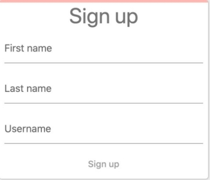
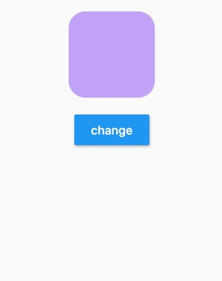

# Good for beginners
If you’re new to Flutter, we recommend starting with one of these codelabs:

## 1. [Write your first Flutter app, part 1](https://codelabs.developers.google.com/codelabs/first-flutter-app-pt1/)  

- Create a simple mobile app that generates proposed names for a startup company. 
- In part one, you’ll use a package that returns pairs of words at random and inserts them into an infinite scrolling list.

## 2. [Write Your First Flutter App, part 2](https://codelabs.developers.google.com/codelabs/first-flutter-app-pt2/) 

- Create a simple mobile app that generates proposed names for a startup company. 
- In part two, you’ll extend the example from part 1 to allow the user to select favorite word pairs, and add a second “Saved Favorites” page where users can view the selected names. 
- Finally, you’ll change the app’s theme color.

## 3. [Write your first Flutter app on the web](https://flutter.dev/docs/get-started/codelab-web)

- Implement a simple web app in DartPad (no downloads required!) that displays a sign-in screen containing three text fields. 
- As the user fills out the fields, a progress bar animates along the top of the sign-in area. 
- This codelab is written specifically for the web, but if you have downloaded and configured Android and iOS tooling, the completed app works on Android and iOS devices, as well.

## 4. [Building beautiful UIs with Flutter](https://codelabs.developers.google.com/codelabs/flutter/)

- A deeper “first dive” than “Write your first Flutter app.” 
- Create a chat app that includes a simple animation, and customizes the UI for iOS and Android. 
- As part of this codelab, learn how to use keyboard shortcuts in Android Studio.

# Designing a Flutter UI
Learn about Material Design and basic Flutter concepts, like layout and animations:

## 1. [Basic Flutter layout concepts](https://flutter.dev/docs/codelabs/layout-basics)

- Use DartPad in a browser (no downloads required!) to learn the basics of creating a Flutter layout.

## 2. [Implicit animations](https://flutter.dev/docs/codelabs/implicit-animations)

- Use DartPad (no downloads required!) to learn how to use implicit animations to add motion and create visual effects for the widgets in your UI.

## 4. [Building Beautiful Transitions with Material Motion for Flutter](https://codelabs.developers.google.com/codelabs/material-motion-flutter/)
- Learn how to use the Material animations package to add pre-built transitions to a Material app called Reply.

## 5. [MDC 101 Flutter: Material Components (MDC) Basics](https://codelabs.developers.google.com/codelabs/mdc-101-flutter/)
- Learn the basics of using Material Components by building a simple app with core components. 
- The four MDC codelabs guide you through building an e-commerce app called Shrine. 
- You’ll start by building a login page using several of MDC Flutter’s components.

## 6. [MDC 102 Flutter: Material Structure and Layout](https://codelabs.developers.google.com/codelabs/mdc-102-flutter/)
- Learn how to use Material for structure and layout in Flutter. 
- Continue building the e-commerce app, introduced in MDC-101, by adding navigation, structure, and data.

## 7. [MDC 103 Flutter: Material Theming with Color, Shape, Elevation, and Type](https://codelabs.developers.google.com/codelabs/mdc-103-flutter/)
- Discover how Material Components for Flutter make it easy to differentiate your product, and express your brand through design. 
- Continue building your e-commerce app by adding a home screen that displays products.

## 8. [MDC 104 Flutter: Material Advanced Components](https://codelabs.developers.google.com/codelabs/mdc-104-flutter/)
- Improve your design and learn to use our advanced component backdrop menu. 
- Finish your e-commerce app by adding a backdrop with a menu that filters products by the selected category.

# Using Flutter with …
Learn how to use Flutter with other technologies.

## 1. [Adding Google Maps to a Flutter app](https://codelabs.developers.google.com/codelabs/google-maps-in-flutter/)
- Display a Google map in an app, retrieve data from a web service, and display the data as markers on the map.

## 2. [Build a photo sharing app with Google Photos and Flutter](https://codelabs.developers.google.com/codelabs/google-photos-sharing/)
- Build a field trip app that allows you and other members of the trip to share photos.

## 3. [Adding AdMob Ads to a Flutter app](https://codelabs.developers.google.com/codelabs/admob-ads-in-flutter/)
- Learn how to add an AdMob banner, an interstitial ad, and a rewarded ad to an app called Awesome Drawing Quiz, a game that lets players guess the name of the drawing.

## 4. [Firebase for Flutter](https://codelabs.developers.google.com/codelabs/flutter-firebase/)
- Connect a Flutter app to a Firebase database, and use a transaction to update shared information.

## 5. [Multi-platform Firestore Flutter](https://codelabs.developers.google.com/codelabs/friendlyeats-flutter/)
- Build a multi-platform restaurant recommendation app powered by Flutter and Cloud Firestore. 
- The finished app runs on Android, iOS, and web, from a single Dart codebase.
