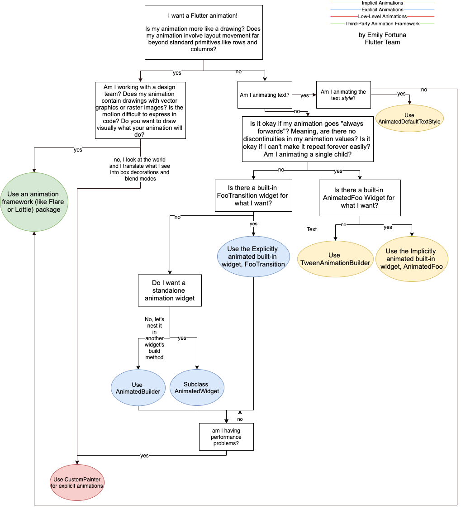

# Chapter 03: User interface 
## 1. What are the widgets?
Answer: Widgets describe what their view should look like given their current configuration and state.

## 2. What widgets are there commonly used?
Answer: Flutter comes with a suite of powerful basic widgets, of which the following are commonly used:

- Text: The Text widget lets you create a run of styled text within your application.
- Row, Column: These flex widgets let you create flexible layouts in both the horizontal (Row) and vertical (Column) directions. The design of these objects is based on the web’s flexbox layout model.
- Stack: Instead of being linearly oriented (either horizontally or vertically), a Stack widget lets you place widgets on top of each other in paint order. You can then use the Positioned widget on children of a Stack to position them relative to the top, right, bottom, or left edge of the stack. Stacks are based on the web’s absolute positioning layout model.
- Container: The Container widget lets you create a rectangular visual element. A container can be decorated with a BoxDecoration, such as a background, a border, or a shadow. A Container can also have margins, padding, and constraints applied to its size. In addition, a Container can be transformed in three dimensional space using a matrix.

## 3. Draw the diagram of the widget tree for Flutter UI.
Answer: 

## 4. How  to arrange widgets vertically or horizontally?
Answer: You can use a Row widget to arrange widgets horizontally, and a Column widget to arrange widgets vertically.

## 5. How to align widgets?
Answer: You control how a row or column aligns its children using the mainAxisAlignment and crossAxisAlignment properties.

## 6. What widgets are in the widgets library and the Material library?
Answer:The following widgets fall into two categories: standard widgets from the widgets library, and specialized widgets from the Material library.  
<strong>Standard widgets</strong>
- Container: Adds padding, margins, borders, background color, or other decorations to a widget.
- GridView: Lays widgets out as a scrollable grid.
- ListView: Lays widgets out as a scrollable list.
- Stack: Overlaps a widget on top of another.
<strong>Material widgets</strong>
- Card: Organizes related info into a box with rounded corners and a drop shadow.
- ListTile: Organizes up to 3 lines of text, and optional leading and trailing icons, into a row.

## 7. How does a responsive app lay out its UI?
Answer: A responsive app lays out its UI according to the size and shape of the screen or window. This is especially necessary when the same app can run on a variety of devices, from a watch, phone, tablet, to a laptop or desktop computer. 

## 8. What approaches are used to create Flutter apps with responsive design?
Answer: There are two basic approaches to creating Flutter apps with responsive design: Use the LayoutBuilder class, Use the MediaQuery.of() method in your build functions.

## 9. What important limitations does Flutter’s layout engine has?
Answer: Flutter’s layout engine has a few important limitations:

- A widget can decide its own size only within the constraints given to it by its parent. This means a widget usually can’t have any size it wants.

- A widget can’t know and doesn’t decide its own position in the screen, since it’s the widget’s parent who decides the position of the widget.

- Since the parent’s size and position, in its turn, also depends on its own parent, it’s impossible to precisely define the size and position of any widget without taking into consideration the tree as a whole.

## 10. How does the boxes handle their constraints?
Answer: Generally, there are three kinds of boxes, in terms of how they handle their constraints:
- Those that try to be as big as possible. For example, the boxes used by Center and ListView.
- Those that try to be the same size as their children. For example, the boxes used by Transform and Opacity.
- Those that try to be a particular size. For example, the boxes used by Image and Text.

## 11. List some stateful and stateless widgets.
Answer: A widget is either stateful or stateless. If a widget can change—when a user interacts with it, for example—it’s stateful.

- A stateless widget never changes. Icon, IconButton, and Text are examples of stateless widgets. Stateless widgets subclass StatelessWidget.

- A stateful widget is dynamic: for example, it can change its appearance in response to events triggered by user interactions or when it receives data. Checkbox, Radio, Slider, InkWell, Form, and TextField are examples of stateful widgets. Stateful widgets subclass StatefulWidget.

## 12. How to implemente a Flutter animation?
Answer: the following decision tree helps you decide what approach to use when implementing a Flutter animation.

## 13. What are the four types of pointer events?
Answer: Pointers represent raw data about the user’s interaction with the device’s screen. 

- PointerDownEvent: The pointer has contacted the screen at a particular location.
- PointerMoveEvent: The pointer has moved from one location on the screen to another.
- PointerUpEvent: The pointer has stopped contacting the screen.
- PointerCancelEvent: Input from this pointer is no longer directed towards this app.

## 14. What are the gestures and the events?
Answer: Gestures represent semantic actions (for example, tap, drag, and scale) that are recognized from multiple individual pointer events, potentially even multiple individual pointers. Gestures can dispatch multiple events, corresponding to the lifecycle of the gesture (for example, drag start, drag update, and drag end).
